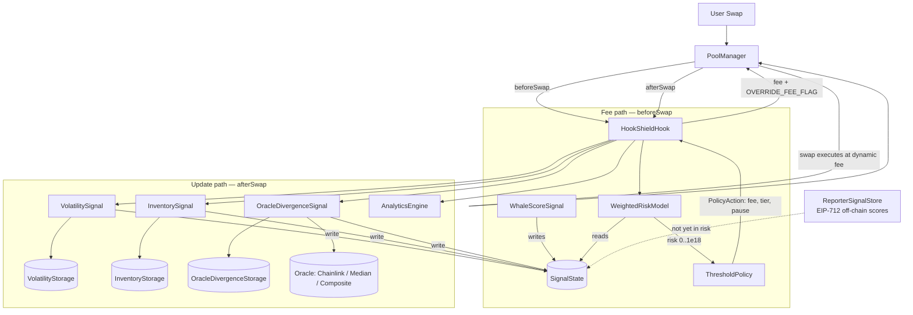

<div align="center">

# 🛡️ HookShield

**Adaptive, risk-weighted dynamic fees for Uniswap v4 — on-chain market signals priced into every swap**

[](https://github.com/Yash-arch-ui/HookShield/actions/workflows/test.yml)


Solidity `0.8.26` · Foundry · Uniswap v4 Hooks · Rust simulator

</div>

---

## Table of Contents

- [Overview](#overview)
- [Why Dynamic Fees?](#why-dynamic-fees)
- [Architecture](#architecture)
- [Swap Lifecycle](#swap-lifecycle)
- [Key Design Decisions (P0–P3)](#key-design-decisions-p0p3)
- [Components](#components)
  - [1. HookShieldHook](#1-hookshieldhook--the-v4-hook)
  - [2. Signal Catalog](#2-signal-catalog)
  - [3. Risk Model](#3-weightedriskmodel)
  - [4. Fee Policy](#4-thresholdpolicy--the-fee-policy)
  - [5. Volatility Math](#5-volatility--the-math-library)
  - [6. Storage Layer](#6-storage-layer)
  - [7. Oracle Layer](#7-oracle-layer)
  - [8. AnalyticsEngine](#8-analyticsengine)
  - [9. ReporterSignalStore](#9-reportersignalstore--off-chain-scores)
- [Default Parameters](#default-parameters)
- [Security Model](#security-model)
- [Known Limitations](#known-limitations)
- [Project Structure](#project-structure)
- [Getting Started](#getting-started)
- [Verify the Project in 60 Seconds](#verify-the-project-in-60-seconds)
- [Rust Simulator](#rust-simulator)
- [Deployment](#deployment)
- [Testing](#testing)
- [Audits & Reports](#audits--reports)
- [Roadmap](#roadmap)
- [License](#license)

---

## Overview

**HookShield** is a [Uniswap v4](https://github.com/Uniswap/v4-core) hook that replaces the pool's static swap fee with an **adaptive fee computed on-chain, per swap**, from live market conditions.

Static AMMs charge the same 0.05% / 0.30% / 1.00% regardless of market state. HookShield evaluates every swap against four independent on-chain signals — **volatility, inventory skew, oracle divergence, and whale impact** — aggregates them into a single normalized risk score in `[0, 1e18]`, and maps that score to a fee through a **continuous quadratic curve**, with a **circuit breaker** that halts swaps at extreme risk.

The design is **fully modular**: signals, the risk model, and the fee policy are separate, replaceable contracts wired together at deployment time. Signals, risk model, and policy communicate only through narrow interfaces (`ISignal`, `IRiskModel`, `IPolicy`), so any component can be swapped without touching the hook.

| Metric | Value |
|---|---|
| Solidity (src + script + test) | ~4,800 lines |
| Rust (simulator + reporter lib) | ~2,100 lines |
| Test suites | 16 Forge suites — **172 tests**, all passing |
| Rust tests | **66 tests**, all passing |
| Fuzz tests | 13 (volatility math) |
| Hook runtime bytecode | 6,116 B (EIP-170 limit 24,576 B) |
| Deployed network | Sepolia (`11155111`) |

---

## Why Dynamic Fees?

| Problem with static fees | How HookShield responds |
|---|---|
| Fixed fees underprice risk in volatile markets, exposing LPs to adverse selection and impermanent loss. | Fees scale with a dual-horizon EWMA volatility estimate (fast momentum + slow variance channel). |
| Calm, deep markets charge traders more than necessary. | Fees fall back to the 0.30% base when signals are quiet. |
| One-directional flow ("inventory skew") invites arbitrage that drains one side of the pool. | Skewed pools pay more; swaps that **rebalance** the pool get a discount. |
| A single whale swap can move price violently and harm LPs. | The whale signal scores the *incoming* swap's price impact **before** it executes and prices it into that same swap's fee. |
| Stale or manipulated oracle data can be gamed for cheaper fees. | Per-field staleness deadlines escalate stale signals to **maximum risk / maximum fee**. |
| Fee tiers are fixed at pool creation. | Every swap can carry a different fee via v4's dynamic fee override. |

---

## Architecture



### Key design decisions

- **Read hot path, write cold path.** `beforeSwap` only *reads* (`riskModel.risk()` + `policy.action()`); all state mutation happens in `afterSwap`. The fee decision path stays minimal and deterministic.
- **One exception — whale score writes in `beforeSwap`.** A whale fee must reflect *this* swap's own price impact, which is only knowable pre-execution. The read-after-write is safe: `beforeSwap` is atomic, and the score is a deterministic function of inputs the swapper already controls (`amountSpecified`, current liquidity).
- **Hard fee override.** The pool is created with `LPFeeLibrary.DYNAMIC_FEE_FLAG`; the hook returns `fee | LPFeeLibrary.OVERRIDE_FEE_FLAG`, so the `PoolManager` charges exactly what HookShield computed.
- **Stale = max risk.** Any expired core signal returns `STALE_FALLBACK_RISK = 1e18` (maximum fee), never a comfortable middle ground — an attacker cannot pin a low reading, wait out the staleness window, and coast on a mid-tier fee.
- **Circuit breaker with dead-band hysteresis.** Halt at `risk ≥ 0.95e18`, resume only at `risk ≤ 0.85e18` — the pause flag cannot flicker on/off around a single threshold.
- **Stale-aware pause enforcement.** When signals are stale, risk would escalate to `SCALE` and latch the breaker with no way out (a paused pool can't refresh signals). The hook skips enforcement while stale, letting exactly one swap through to republish signals.
- **All four signals are hook-only writers.** Each signal has a one-time `setHook()` binding; nobody can spoof observations after deployment.

---

## Swap Lifecycle

```text
┌────────────────────────────────────────────────────────────────────────────┐
│ 1. User calls PoolManager.swap()                                          │
│ 2. PoolManager → hook.beforeSwap()                                        │
│    ├─ whaleSignal.update(poolId, tradeSize, direction)   ← writes score   │
│    ├─ liquidity = poolManager.getLiquidity(poolId)                        │
│    ├─ riskE18   = riskModel.risk(poolId, tradeSize, liquidity)             │
│    │              ├─ stale? → return 1e18 (max risk)                       │
│    │              ├─ Σ(signal_i × weight_i) / 1e18                         │
│    │              └─ + min(tradeSize/liquidity, 0.3e18)  ← pressure term   │
│    ├─ act = policy.action(poolId, riskE18, zeroForOne, netFlow)            │
│    │        ├─ fee = 3000 + 9000 × risk²/1e36      ← quadratic curve      │
│    │        ├─ +500 if worsens inventory skew / −200 if rebalances         │
│    │        ├─ latch/unlatch pause with 0.10 dead-band                     │
│    │        └─ tier label (analytics only)                                 │
│    ├─ if (pause && signals fresh) → emit SwapsHalted; revert SwapsPaused   │
│    └─ return (selector, delta, fee | OVERRIDE_FEE_FLAG)                    │
│ 3. Swap executes at the computed fee                                       │
│ 4. PoolManager → hook.afterSwap()                                          │
│    ├─ volatilitySignal.update(poolId, sqrtPriceX96, tradeSize)             │
│    ├─ inventorySignal.update(poolId, zeroForOne)                           │
│    ├─ oracleSignal.update(poolId, sqrtPriceX96)                            │
│    └─ analyticsEngine.recordSwap(...)                                      │
│ 5. Settlement — fee charged, signals ready for the next swap               │
└────────────────────────────────────────────────────────────────────────────┘
```

---

## Key Design Decisions (P0–P3)

The protocol went through four hardening rounds driven by internal research and audits:

| Round | Theme | What changed |
|---|---|---|
| **P0** | Staleness & access control | Per-field staleness deadlines (a single shared window could mask one stale field); default window cut **60 min → 5 min**; stale fallback raised **0.5e18 → 1e18**; all four signals got one-time `setHook()` + `onlyHook`. |
| **P1** | Fee curve & volatility hygiene | Discrete 5-step fee ladder replaced by a **continuous quadratic curve** (no cliffs); per-observation return **clamped at 5%**; dust filter (`minObservationSize`) so junk swaps can't manufacture fake volatility. |
| **P2** | Signal quality & pricing | **Dual-horizon volatility** (slow variance EWMA + fast return EWMA, published as `max(slow, fast)` — momentum boost with anti-flicker hold); size/liquidity **pressure term**; **direction-aware** inventory surcharge/discount. |
| **P3** | Circuit breaker | Halt at `risk ≥ 0.95e18`, dead-band unpause at `≤ 0.85e18`; enforcement skipped while signals are stale to avoid a permanent deadlock. |

---

## Components

### 1. `HookShieldHook` — the v4 hook

The single entry point. Registered permissions: **`beforeSwap` + `afterSwap` only** (everything else is a no-op pass-through, verified by `getHookPermissions()`).

| Member | Purpose |
|---|---|
| `beforeSwap(...)` | Whale score → risk → policy → fee override; may revert `SwapsPaused()` |
| `afterSwap(...)` | Updates volatility / inventory / oracle signals; records analytics |
| `onlyPoolManager` | All hook logic callable only by the `PoolManager` |
| `latestFee`, `lastSwapTriggered` | Inspection getters |
| Events | `DynamicFeeComputed(tradeSize, riskE18, fee, tier)`, `SwapsHalted(poolId, riskE18)` |

Constructor takes 8 addresses: `poolManager`, four signals (`volatility`, `inventory`, `whale`, `oracle`), `riskModel`, `policy`, `analyticsEngine`.

### 2. Signal Catalog

Signals share the `ISignal` convention — `compute()` returns the current normalized value, `update()` recomputes and publishes into `SignalState` (only `VolatilitySignal` formally declares `is ISignal`; the others follow the same shape with signal-specific `update` arguments). Every published value is normalized to `[0, 1e18]`.

| # | Signal | Triggered | Storage | Formula | Meaning of `1e18` |
|---|---|---|---|---|---|
| 1 | **VolatilitySignal** | `afterSwap` (dust-filtered) | `VolatilityStorage` | dual EWMA on returns (see [§5](#5-volatility--the-math-library)) | extreme volatility |
| 2 | **InventorySignal** | `afterSwap` | `InventoryStorage` | `netFlow ± tradeSize` (step = `FLOW_STEP·tradeSize/REFERENCE_SIZE`), clamped `±10e18`; `skew = |netFlow| / 10e18` | fully one-sided flow |
| 3 | **OracleDivergenceSignal** | `afterSwap` | `OracleDivergenceStorage` | `|oraclePrice − poolPrice| / oraclePrice`, capped | pool completely off-market |
| 4 | **WhaleScoreSignal** | **`beforeSwap`** (stateless) | — (direct to `SignalState`) | `2·|√P_next − √P| / √P` via `SqrtPriceMath.getNextSqrtPriceFromInput`, capped | price impact ≥ 100% |

Details:

- **VolatilitySignal** — rejects observations below `minObservationSize` (owner-tunable dust filter): state doesn't advance and the old reading ages out naturally instead of being kept alive by junk trades.
- **InventorySignal** — signed `netFlow` (>0 = skewed toward `zeroForOne`), also exposed via `netFlow()` so the policy can distinguish *worsening* vs *rebalancing* swaps. The per-swap step is **size-scaled (M-5)**: `FLOW_STEP × tradeSize / 1e18`, clamped to `MAX_FLOW`, so a dust trade nudges flow negligibly while a whale trade moves it by up to `±10e18` in one swap. A reference-size (`1e18`) trade reproduces the legacy full step.
- **OracleDivergenceSignal** — pool price derived from `sqrtPriceX96² / 2^192` with a 128-bit split to avoid overflow; when the oracle price is `0` the signal publishes `1e18` (max divergence) and emits `OracleUnavailable` instead of silently reporting `0` **(M-6 fixed)**. A never-observed pool publishes `0`.
- **WhaleScoreSignal** — zero liquidity + non-zero trade ⇒ score `1e18`; zero trade ⇒ `0`. It answers *"what will this exact swap do to price?"* before it runs. The score is **direction-aware (M-4)**: `adjust_for_direction` halves the raw impact when the swap *rebalances* the pool's inventory (sells into an over-supplied side), while a swap that worsens skew keeps its full impact.

### 3. `WeightedRiskModel`

Combines the four published signals, the freshest off-chain reporter scores, and a size-pressure term into one score.

```text
riskE18 = (volatility·w_vol + inventorySkew·w_inv + oracleDivergence·w_oracle + whaleScore·w_whale) / 1e18
         + maxFreshReporterScore × reporterWeight / 1e18   ← H-2 reporter term
         + min(tradeSize/liquidity × 1e18, 0.3e18)          ← size/liquidity pressure (P2)
         → capped at 1e18
```

- Weights **must sum to exactly `1e18`** (enforced in constructor and `setWeights`, emits `WeightsUpdated`).
- `signalState.isStale(poolId)` ⇒ return `STALE_FALLBACK_RISK = 1e18` immediately.
- **Reporter term (H-2 fixed):** `max()` over the five reporter scores (JIT, sandwich, flashloan, toxic flow, MEV), each included only while **fresh under its own deadline** (H-3). The weight is owner-tunable via `setReporterWeight` (`<= 1e18`, default `0.3e18`, emits `ReporterWeightUpdated`). Reporter staleness only zeroes its own term — it does **not** trigger the pool-level stale fallback, so expired reports decay instead of escalating fees.
- Pressure term `MAX_PRESSURE = 0.3e18` — a trade whose notional equals active liquidity produces full pressure; anything larger is clamped, so a whale can't overflow the sum and a single term never dominates alone.
- `isStale()` passthrough lets the hook skip pause enforcement while stale.

**Deployment weights:** volatility `0.3`, inventory `0.2`, oracle divergence `0.2`, whale `0.3`, reporter `0.3` (additive).

### 4. `ThresholdPolicy` — the fee policy

Maps `riskE18` → fee (v4 pips: `1_000_000 = 100%`) with three mechanisms:

**a) Continuous quadratic fee curve (P1)**

```text
fee = 3000 + (12000 − 3000) × risk² / 1e36        // = 3000 + 9000·risk²
```

| Risk | Fee (pips) | Equivalent |
|---|---|---|
| 0.0 | 3 000 | 0.30% (base) |
| 0.5 | 5 250 | 0.525% |
| 0.8 | 8 760 | 0.876% |
| 1.0 | 12 000 | 1.20% (ceiling) |

Low risk stays near the base fee; risk dominates only as it approaches 1. The old 5-step ladder had cliffs at each threshold that LPs and swappers found unpredictable — the curve is now continuous, with the tier thresholds (`0.2/0.4/0.6/0.8`) kept **as analytics labels only** (reported in `DynamicFeeComputed`).

**b) Direction-aware inventory adjustment (P2)**

| Condition | Effect |
|---|---|
| Swap worsens the current skew | **+500 pips** (+0.05%) surcharge |
| Swap rebalances the pool | **−200 pips** (−0.05%) discount, floored at base fee |
| Absolute cap | fee ≤ `12000 + 500` pips |

**c) Circuit breaker (P3)**

| Parameter | Value | Behaviour |
|---|---|---|
| `haltThreshold` | `0.95e18` | `risk ≥ halt` ⇒ latch `pausedSwaps[poolId] = true` |
| `unpauseBand` | `0.10e18` | must fall to `≤ 0.85e18` before unlatching (anti-flicker dead-band) |

The hook reverts with `SwapsPaused()` + `SwapsHalted` while latched — but only when signals are fresh (see [Key Design Decisions](#key-design-decisions-p0p3)).

Owner tunables: `setThresholds`, `setFees`, `setHaltParams`, `setInventoryFees` (all validated, e.g. thresholds must be strictly increasing and `≤ 1e18`).

### 5. `Volatility` — the math library

Pure, fuzz-tested fixed-point math (1e18 scale). The estimator follows the **EWMA / RiskMetrics / GARCH(1,1)** recursion:

```text
return    r = |√P_new − √P_old| / √P_old            (monotonic proxy for price return)
clamp     r ← min(r, 0.05e18)                        (per-observation outlier cap, P1)
slow      variance:  V' = 0.1·r² + 0.9·V            →  σ_slow = √(V'·1e18)
fast      |return|:  F' = 0.3·r  + 0.7·F            →  σ_fast = F'
publish    σ = min(max(σ_slow, σ_fast), 1e18)         (momentum boost + anti-flicker hold)
```

| Constant | Value | Role |
|---|---|---|
| `ALPHA` (slow) | `0.1e18` | half-life ≈ 6.6 swaps — stable baseline variance |
| `ALPHA_FAST` | `0.3e18` | half-life ≈ 1.9 swaps — reacts within 2–3 swaps |
| `MAX_OBSERVATION_RETURN` | `0.05e18` | one anomalous print can't dominate many periods |

**Why two horizons:** the slow channel answers *"how volatile is this market?"* (used for the persistent risk level), the fast channel answers *"is it changing right now?"*. Publishing `max(slow, fast)` means a new spike lifts the signal immediately (fast > slow), while calm periods decay at the slow rate instead of flickering back to calm on a single quiet swap.

`sqrt()` uses the Babylonian method (integer, converging); `varianceToVolatility()` re-scales `√(V·1e18)` back to 1e18.

### 6. Storage Layer

State and logic live in separate contracts. Each storage contract is a **pure database** (no math) with a **single writer set exactly once** (`setWriter` → locked):

| Contract | State per pool | Writer |
|---|---|---|
| `VolatilityStorage` | `lastSqrtPriceX96`, `ewmaVolatility`, `ewmaVolatilityFast`, `ewmaVariance`, `lastUpdateBlock` | `VolatilitySignal` |
| `InventoryStorage` | `netFlow` (signed), `lastUpdateBlock` | `InventorySignal` |
| `OracleDivergenceStorage` | `lastOraclePrice`, `lastPoolPrice`, `lastUpdateBlock` | `OracleDivergenceSignal` |

**`SignalState`** is the shared, permissioned snapshot ledger consumed by the risk model:

- Four core fields — `volatility`, `inventorySkew`, `oracleDivergence`, `whaleScore` — **each with its own staleness deadline** (`*ValidUntil`). A single shared window could let one field go stale while others stay fresh (P0 research finding).
- Five reporter fields — `jit`, `sandwich`, `flashloan`, `toxicFlow`, `mev` — share one `validUntil` (not consumed by the risk model yet).
- Writes are `onlyAuthorized` (owner manages `authorizedWriters`) and bounded `value ≤ 1e18`.
- `DEFAULT_STALENESS_WINDOW = 5 minutes`, owner-tunable to `[30 s, 60 min]` so it can't be set to zero (instantly stale) or hours (reintroduces the staleness attack).
- `isStale()` = any core field written but now expired. **Never-written fields are not stale** — they legitimately hold their default of `0` (no observed risk).

### 7. Oracle Layer

| Contract | Spec |
|---|---|
| `ChainlinkOracle` | `AggregatorV3Interface` adapter; rejects `answer ≤ 0` (`NonPositiveAnswer`) and rounds older than `maxStaleness` (`StalePrice`); normalizes to 1e18 by feed decimals; `isStale()` view |
| `MedianOracle` | Aggregates ≥ 2 `IOracle` sources; sources that revert are excluded; requires quorum of 2 valid prices, insertion-sorted median |
| `CompositeOracle` | 4 strategies — `Median | Average | Min | Max`; quorum = `max(2, n/2)`; reverting sources skipped; `isStale()` if fewer than quorum fresh |

All implement `IOracle { getPrice() → priceE18, isStale() → bool }`.

### 8. `AnalyticsEngine`

Per-swap observability, written by the hook in `afterSwap` (one-time `setWriter` lock):

- `recordSwap(poolId, tradeSize, riskE18, fee, zeroForOne)` → increments `totalSwaps`, `totalTradeSize`, `totalRiskE18`, `totalFeesCharged`, emits `SwapRecorded(index, poolId, ...)`.
- Views: `avgRiskE18()`, `avgFeesCharged()`.

### 9. `ReporterSignalStore` — off-chain scores

Receives **EIP-712-signed** off-chain risk reports (sandwich, flashloan, toxic flow, JIT, MEV) and writes them into `SignalState`:

- Domain: `HookShieldReporter v1`; typehash `SignalReport(bytes32 poolId,uint8 signalType,uint256 score,uint256 nonce,uint256 validUntil)`.
- Checks: signer ∈ `authorizedReporters` (owner-managed), strictly increasing `nonce` per signer (replay protection), `block.timestamp < validUntil` (expiry), valid enum discriminator.
- Paired Rust crate **`reporter-common`** builds and signs the same struct off-chain (alloy), so reporters and contract share one typed definition.

> ✅ Reporter scores are now read by `WeightedRiskModel` (H-2/H-3): each signal type carries its own `validUntil` deadline stamped at report time; `maxFreshReporterScore` feeds a `reporterWeight`-weighted term before the final SCALE clamp.

---

## Default Parameters

| Parameter | Value | Where |
|---|---|---|
| Fixed-point scale | `1e18` | everywhere |
| EWMA slow α (variance) | `0.1e18` | `Volatility` |
| EWMA fast α (\|return\|) | `0.3e18` | `Volatility` |
| Per-observation return cap | `0.05e18` (5%) | `Volatility` |
| Signal staleness window | `5 minutes` (tunable `30 s – 60 min`) | `SignalState` |
| Stale fallback risk | `1e18` (max fee) | `WeightedRiskModel` |
| Size/liquidity pressure cap | `0.3e18` | `WeightedRiskModel` |
| Reporter weight | `0.3e18` (owner-tunable) | `WeightedRiskModel` |
| Inventory reference size | `1e18` (flow step scales as `tradeSize / 1e18`) | `InventorySignal` |
| Rebalance discount (M-4) | `0.5e18` (halves impact on rebalancing swaps) | `WhaleScoreSignal` |
| Deployment risk weights | vol `0.3` / inv `0.2` / oracle `0.2` / whale `0.3` | `Deploy.s.sol` |
| Base fee / max fee | `3000` / `12000` pips (0.30% / 1.20%) | `ThresholdPolicy` |
| Fee curve | quadratic, `3000 + 9000·risk²` | `ThresholdPolicy` |
| Tier thresholds (labels) | `0.2 / 0.4 / 0.6 / 0.8` | `ThresholdPolicy` |
| Inventory surcharge / discount | `+500` / `−200` pips | `ThresholdPolicy` |
| Halt threshold / unpause band | `0.95e18` / `0.10e18` | `ThresholdPolicy` |
| Inventory flow step / cap | `1e18` per swap / `±10e18` | `InventorySignal` |
| Volatility dust filter | `minObservationSize` (owner-set, `0` = legacy) | `VolatilitySignal` |
| Pool tick spacing | `60`, `LPFeeLibrary.DYNAMIC_FEE_FLAG` | `InitializePool.s.sol` |
| Seeded liquidity | `1e18` over ticks `[-600, 600]` | `InitializePool.s.sol` |

---

## Security Model

**Access-control matrix**

| Contract | Protected by |
|---|---|
| `HookShieldHook` | `onlyPoolManager` for state-mutating logic; hook address encodes `beforeSwap+afterSwap` flags (CREATE2-mined) |
| `VolatilitySignal` / `InventorySignal` / `WhaleScoreSignal` / `OracleDivergenceSignal` | one-time `setHook()` + `onlyHook` on `update()` — nobody can publish spoofed observations |
| `VolatilityStorage` / `InventoryStorage` / `OracleDivergenceStorage` / `AnalyticsEngine` | single `writer`, set once and locked (`setWriter` reverts on second call) |
| `SignalState` | `onlyAuthorized` writers + owner-managed whitelist; every write bounded `≤ 1e18` |
| `WeightedRiskModel` / `ThresholdPolicy` / `SignalState` | OpenZeppelin `Ownable` admin functions with validation (weights sum, monotone thresholds, window bounds) |
| `ReporterSignalStore` | EIP-712 signature + reporter whitelist + nonce replay guard + report expiry |

**Economic / data-safety bounds**

- **Staleness ⇒ max fee** (`1e18`), never a discount — stale data cannot be gamed downward.
- **All published signals clamped to `[0, 1e18]`**, inventory flow clamped `±10e18`, pressure capped `0.3e18`, final risk capped `1e18` — no runaway value can produce an out-of-range score.
- **Fee ceiling** bounded at `12500` pips (1.25%) — trader exposure is capped even at maximum risk.
- **Return clamp (5%)** stops a single oracle glitch / thin-liquidity wick from dominating the EWMA for many periods; **dust filter** stops near-zero swaps from manufacturing fake volatility.
- **Circuit breaker dead-band** prevents pause flickering; **stale-aware enforcement** prevents permanent deadlock.
- **The hook holds no funds** and the contract set has no token approvals — attack surface is state, not custody.
- `.env` is gitignored; keys never enter the repository.

---

## Known Limitations

Tracked openly in [`AUDITREPORT3.md`](./AUDITREPORT3.md) (also [`AUDIT_REPORT.md`](./AUDIT_REPORT.md), [`AUDIT_REPORT_V2.md`](./AUDIT_REPORT_V2.md)):

| ID | Finding | Status |
|---|---|---|
| M-3 | No rate limiting on `ReporterSignalStore` (nonce must increase, but no cooldown) | Open |
| L-1 | Rust fetcher: same-block swaps reuse previous block's `sqrtPriceX96` as "before" price | Open — simulator fidelity only |
| L-4 | `setThresholds` / `setFees` emit no events | Open |

Resolved since those reports: **M-1** (trade size now feeds the pressure term), **M-2** (circuit breaker implemented, P3), **H-1** (latest Sepolia deployment uses the current 8-argument constructor including `AnalyticsEngine`), **L-3** (`setWeights` emits `WeightsUpdated`), **H-2** (fresh reporter max feeds `WeightedRiskModel` via `reporterWeight`, default `0.3e18`), **H-3** (per-field reporter deadlines enforced at read time; reporter staleness zeroes its own term only), **M-4** (whale impact halved on rebalancing swaps), **M-5** (inventory flow step scales with trade size), **M-6** (oracle failure ⇒ divergence `1e18` + `OracleUnavailable` event).

---

## Project Structure

```text
.
├── src/
│   ├── hooks/
│   │   └── HookShieldHook.sol          # v4 hook: beforeSwap (fee) / afterSwap (signals)
│   ├── signals/
│   │   ├── SignalState.sol             # shared permissioned snapshot ledger + per-field staleness
│   │   ├── VolatilitySignal.sol        # EWMA volatility observer (dust-filtered)
│   │   ├── InventorySignal.sol         # directional flow → skew score (+ signed netFlow)
│   │   ├── WhaleScoreSignal.sol        # pre-trade price-impact score (stateless)
│   │   └── OracleDivergenceSignal.sol  # pool price vs oracle price
│   ├── risk/
│   │   ├── IRiskModel.sol              # risk(poolId, tradeSize, liquidity) + isStale()
│   │   └── WeightedRiskModel.sol       # weighted signals + pressure term
│   ├── policy/
│   │   ├── IPolicy.sol                 # PolicyAction { fee, pauseSwaps, tier }
│   │   └── ThresholdPolicy.sol         # quadratic curve + inventory adj. + circuit breaker
│   ├── oracle/
│   │   ├── IOracle.sol                 # getPrice() / isStale()
│   │   ├── ChainlinkOracle.sol         # AggregatorV3 adapter with staleness checks
│   │   ├── MedianOracle.sol            # quorum median over ≥2 sources
│   │   └── CompositeOracle.sol         # Median/Average/Min/Max strategies
│   ├── analytics/
│   │   └── AnalyticsEngine.sol         # per-swap metrics + aggregates
│   ├── reporter/
│   │   └── ReporterSignalStore.sol     # EIP-712 verified off-chain scores
│   ├── libraries/
│   │   └── Volatility.sol              # return calc, dual EWMA, sqrt, clamp, pipeline
│   ├── interfaces/
│   │   ├── ISignal.sol                 # compute() / update(poolId, sqrtPrice, tradeSize)
│   │   ├── IOracle.sol
│   │   └── AggregatorV3Interface.sol
│   ├── VolatilityStorage.sol           # per-pool volatility state (single writer)
│   ├── InventoryStorage.sol            # per-pool netFlow state (single writer)
│   ├── OracleDivergenceStorage.sol     # per-pool oracle/pool price state (single writer)
│   └── _deprecated/                    # pre-modular architecture (excluded from build)
├── script/
│   ├── DeployPoolManager.s.sol         # fresh PoolManager
│   ├── Deploy.s.sol                    # full stack + CREATE2-mined hook + setHook wiring
│   ├── InitializePool.s.sol            # tokens, dynamic-fee pool, seeded liquidity
│   └── TestSwap.s.sol                  # 0.1-token swap through the live pool
├── test/
│   ├── unit/                           # 15 unit suites (incl. 13 fuzz tests)
│   ├── integration/                    # HookShieldFullSwap — end-to-end swap flows
│   └── mocks/                          # MockAggregatorV3
├── hookshield-simulator/               # Rust: historical swap replay, static vs dynamic fees
├── reporter-common/                    # Rust: EIP-712 report signing/submission library
├── lib/                                # forge-std, v4-core, v4-periphery (submodules)
├── foundry.toml                        # solc 0.8.26, cancun, via_ir
├── .github/workflows/test.yml          # CI: fmt --check, build --sizes, test
├── DEPLOYMENTS.md                      # live Sepolia addresses
└── AUDIT_REPORT*.md / AUDITREPORT3.md  # audit & research reports
```

---

## Getting Started

### Prerequisites

- [Foundry](https://book.getfoundry.sh/getting-started/installation) (`forge`, `cast`, `anvil`)
- Rust toolchain (`rustup`) — for the simulator and reporter library
- Git submodules:

```bash
git submodule update --init --recursive
```

### Build

```bash
forge build
```

### Test

```bash
forge test          # 172 tests, ~1s
forge test -vvv     # verbose traces
forge test --match-contract VolatilityFuzzTest -vv   # fuzz suite only
```

### Format

```bash
forge fmt
```

### Simulator tests

```bash
cargo test --manifest-path hookshield-simulator/Cargo.toml   # 66 tests
```

**CI** (`.github/workflows/test.yml`) runs `forge fmt --check`, `forge build --sizes`, and `forge test -vvv` on every push and pull request.

**Toolchain:** `solc 0.8.26`, EVM `cancun`, `via_ir`, optimizer `44,444,444` runs, `src/_deprecated/**` skipped by the build.

---

## Verify the Project in 60 Seconds

The fastest way to demonstrate the project end-to-end (useful for reviews/interviews):

```bash
# 1. Build — compiles the full stack
forge build

# 2. Test — 172 tests incl. 13 fuzz tests on the EWMA math
forge test

# 3. Gas profile — beforeSwap hot path + contract sizes
forge test --gas-report
forge build --sizes

# 4. Static checks
forge fmt --check

# 5. Rust simulator tests — 66 tests mirroring the Solidity math
cargo test --manifest-path hookshield-simulator/Cargo.toml

# 6. Live network — deployed contracts on Sepolia
cat DEPLOYMENTS.md                                   # documented address set
cast call <HookShieldHook address> "latestFee()(uint24)" --rpc-url $SEPOLIA_RPC_URL
cast call <ThresholdPolicy address> "haltThreshold()(uint256)" --rpc-url $SEPOLIA_RPC_URL
```

What each step proves: **(1–2)** correctness of the fee pipeline and volatility math (fuzz-proven convex-combination/convergence properties), **(3)** the hot path stays cheap and bytecode fits EIP-170, **(4)** CI-clean formatting, **(5)** the Rust simulator is a faithful mirror of the on-chain math, **(6)** real deployed contracts on a public testnet.

---

## Rust Simulator

`hookshield-simulator/` replays historical `Swap` events fetched from an RPC endpoint and compares **static-fee revenue vs HookShield revenue** for the same trade sequence — a counterfactual backtest.

```bash
cargo run --manifest-path hookshield-simulator/Cargo.toml -- \
  --rpc-url <RPC_URL> \
  --pool-manager 0xCf5eC7911EbEECfE45373086d6f5080BB8863a08 \
  --pool-id <POOL_ID bytes32 hex> \
  --from-block <N> --to-block <M> \
  --base-fee 3000 \
  --format text        # or: json
```

Output: swap count, total volume, static-fee revenue, HookShield revenue, **LVR reduction %**, and a per-swap whale-score table (truncated at 25 rows in text mode; `--format json` emits the full series).

The simulator mirrors the on-chain logic 1:1 — `math.rs` (EWMA, quadratic fee, inventory adjustment, circuit breaker), `whale.rs`, `inventory.rs`, `risk.rs` (weights + pressure term + stale escalation), `snapshot.rs` (per-field staleness) — so behaviour changes land in **both** codebases in the same commit.

---

## Deployment

HookShield is deployed on **Sepolia** (`chainId 11155111`). [`DEPLOYMENTS.md`](./DEPLOYMENTS.md) documents the address set; the newest deployment (with the current 8-argument hook constructor including `AnalyticsEngine`) is recorded in `broadcast/Deploy.s.sol/11155111/run-latest.json` — all 21 receipts in that run are `0x1` success. Always cross-check `run-latest.json` when in doubt, since `DEPLOYMENTS.md` lags behind redeploys.

### Why CREATE2?

Uniswap v4 encodes hook permissions **in the hook's address**. `Deploy.s.sol` uses `HookMiner.find()` to mine a salt such that the CREATE2-predicted address satisfies `Hooks.BEFORE_SWAP_FLAG | Hooks.AFTER_SWAP_FLAG`, then asserts `address(hook) == predicted`.

### Wiring performed at deployment

1. Deploy storage contracts → `setWriter(<signal>)` (locked on first call).
2. Deploy signals → `signalState.setAuthorizedWriter(<signal>, true)`.
3. Deploy `WeightedRiskModel` (weights `0.3/0.2/0.2/0.3`), `ThresholdPolicy`, `AnalyticsEngine`.
4. Mine salt, deploy `HookShieldHook` via CREATE2, assert predicted address.
5. **`setHook(<hook>)` on all four signals** and `analyticsEngine.setWriter(<hook>)` — publisher binding is one-time.

### Scripts & environment variables

| Script | Purpose | Required env vars |
|---|---|---|
| `DeployPoolManager.s.sol` | Fresh `PoolManager` | `PRIVATE_KEY` |
| `Deploy.s.sol` | Full stack + mined hook | `PRIVATE_KEY`, `POOL_MANAGER_ADDRESS`, `ORACLE_FEED_ADDRESS`, `ORACLE_MAX_STALENESS` |
| `InitializePool.s.sol` | Tokens + dynamic-fee pool + seeded liquidity | `PRIVATE_KEY`, `POOL_MANAGER_ADDRESS`, `HOOK_SHIELD_HOOK_ADDRESS` |
| `TestSwap.s.sol` | 0.1-token swap through the live pool | `PRIVATE_KEY`, `POOL_MANAGER_ADDRESS`, `HOOK_SHIELD_HOOK_ADDRESS`, `CURRENCY0_ADDRESS`, `CURRENCY1_ADDRESS`, `SWAP_ROUTER_ADDRESS` |

```bash
source .env    # PRIVATE_KEY, POOL_MANAGER_ADDRESS, ORACLE_FEED_ADDRESS, ...
forge script script/Deploy.s.sol:Deploy --rpc-url $SEPOLIA_RPC_URL --broadcast
```

> 🔑 Never commit `.env`. The file is gitignored; use a throwaway testnet key.

---

## Testing

**172 Forge tests across 16 suites — all passing (~0.7 s).**

| Suite | Tests | Covers |
|---|---:|---|
| `SignalState.t.sol` | 29 | per-field staleness, bounds, authorization, reporter fields |
| `ThresholdPolicy.t.sol` | 20 | quadratic curve vs reference, boundaries, inventory adj., halt/unhalt hysteresis, owner-only |
| `Volatility.t.sol` (fuzz) | 17 | return formula, EWMA convex combination + convergence, variance/std, `sqrt`, clamp-at-5%, momentum boost, slow-hold |
| `CompositeOracle.t.sol` | 14 | all 4 strategies, partial failure, quorum, constructor validation |
| `MedianOracle.t.sol` | 12 | odd/even median, partial failure, staleness |
| `AnalyticsEngine.t.sol` | 11 | aggregation, views, writer lock |
| `WeightedRiskModel.t.sol` | 10 | weight validation, pressure term, stale ⇒ `SCALE`, no-signal default |
| `InventorySignal.t.sol` | 9 | step/clamp, skew normalization, `netFlow`, hook-only |
| `VolatilitySignal.t.sol` | 8 | dust filter, storage round-trip, hook-only |
| `ReporterSignalStore.t.sol` | 8 | EIP-712 verify, bad signer, nonce replay, expiry |
| `InventoryStorage.t.sol` / `OracleDivergenceSignal.t.sol` | 7 + 7 | writer access control; divergence math + oracle failure |
| `VolatilityStorage.t.sol` | 6 | single-writer, zero-address, round-trip |
| **`HookShieldFullSwap.t.sol` (integration)** | **6** | base-fee first swap → rising fees under volatility, inventory skew up/down, repeated-direction saturation |
| `HookShieldHook.t.sol` | 5 | permissions flags, latestFee, accessors |
| `WhaleScoreSignal.t.sol` | 3 | zero-liquidity ⇒ max, publish path |

**66 Rust tests** (1 ignored) covering the mirrored math: EWMA, fee curve, whale impact, inventory, staleness, LVR reduction sign.

---

## Audits & Reports

| Document | Contents |
|---|---|
| [`AUDITREPORT3.md`](./AUDITREPORT3.md) | Latest full audit: Solidity + Rust findings (H/M/L table), test results, deployment review |
| [`AUDIT_REPORT_V2.md`](./AUDIT_REPORT_V2.md) | Access-control & authorization review; Rust↔Solidity constant parity |
| [`AUDIT_REPORT.md`](./AUDIT_REPORT.md) | Architecture vs original design (module coverage matrix), step-by-step flow walkthrough |
| [`DEPLOYMENTS.md`](./DEPLOYMENTS.md) | Live Sepolia addresses |

**Research lineage of the math:** the EWMA update is the RiskMetrics (J.P. Morgan, 1996) / GARCH(1,1) conditional-variance recursion ported to fixed-point Solidity. The quadratic fee curve, dual-horizon channels, observation clamp, and circuit-breaker dead-band are in-house engineering decisions developed through the P0–P3 hardening rounds (documented in commit history), not lifted from a paper.

---

## Roadmap

- [x] Modular signal → risk → policy pipeline behind narrow interfaces
- [x] Dual-horizon EWMA volatility with fuzz-tested math (clamp, momentum boost, anti-flicker)
- [x] Direction-aware inventory pricing (surcharge / discount) + signed `netFlow`
- [x] Pre-trade whale score priced into the same swap's fee
- [x] Oracle divergence signal (Chainlink + Median/Composite aggregators)
- [x] Continuous quadratic fee curve (replaced discrete ladder)
- [x] Circuit breaker with dead-band hysteresis + stale-aware enforcement
- [x] Per-field staleness deadlines; stale ⇒ max fee
- [x] EIP-712 reporter pipeline (`ReporterSignalStore` + `reporter-common`)
- [x] Rust backtest simulator (static vs dynamic fees, LVR reduction)
- [x] Sepolia deployment with CREATE2-mined hook address
- [x] Wire reporter scores (JIT/sandwich/flashloan/toxic/MEV) into `WeightedRiskModel` with per-field staleness (H-2/H-3)
- [x] Size-scaled inventory flow (replace fixed `1e18` step, M-5)
- [x] Directional whale score (M-4) and oracle-failure signalling (M-6)
- [ ] Rate limiting for reporter submissions (M-3)
- [ ] Admin-change events on `setThresholds` / `setFees` (L-4)
- [ ] Multi-pool production deployment & signal routing
- [ ] External audit

---

## License

MIT — see the SPDX headers in the individual contracts.
