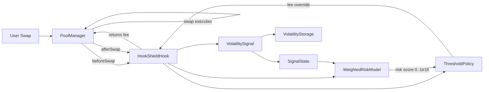

<div align="center">

# 🛡️ HookShield

**Adaptive Risk-Weighted Fees for Uniswap v4 — Dynamic fees driven by on-chain market signals**

Solidity `0.8.26` · Foundry · Uniswap v4 Hooks

</div>

---

## Table of Contents

- [Overview](#overview)
- [Why Dynamic Fees?](#why-dynamic-fees)
- [Architecture](#architecture)
- [How It Works](#how-it-works)
- [Components](#components)
  - [HookShieldHook](#1-hookshieldhook--the-v4-hook)
  - [Signals & State](#2-signals--state)
  - [Risk Model](#3-risk-model)
  - [Policy](#4-policy)
  - [Storage & Libraries](#5-storage--libraries)
- [Default Parameters](#default-parameters)
- [Project Structure](#project-structure)
- [Getting Started](#getting-started)
- [Deployment](#deployment)
- [Testing](#testing)
- [Security Considerations](#security-considerations)
- [Roadmap](#roadmap)
- [License](#license)

---

## Overview

**HookShield** is a [Uniswap v4](https://github.com/Uniswap/v4-core) hook that replaces the static swap fee of a pool with an **adaptive, risk-weighted fee** computed at execution time from live on-chain market conditions.

Traditional AMMs charge a fixed fee tier (0.05%, 0.30%, 1.00%, …) regardless of what is happening in the market. HookShield instead evaluates each swap against a pipeline of on-chain *signals* — volatility, inventory skew, oracle divergence, and whale activity — aggregates them into a single normalized risk score, and maps that score to a fee tier. When markets get rough, LPs are compensated; when conditions are calm, traders pay less.

The design is **fully modular**: signals, the risk model, and the fee policy are independent, replaceable contracts wired together at deployment time.

---

## Why Dynamic Fees?

| Problem with static fees | How HookShield responds |
|---|---|
| Fixed fees underprice risk during volatile periods, exposing LPs to adverse selection and impermanent loss. | Fees scale up with realized volatility (EWMA of on-chain price returns). |
| Calm markets with high liquidity charge traders more than necessary. | Fees drop to a base tier when signals indicate low risk. |
| One-directional flow imbalance ("inventory skew") invites arbitrage that drains one side of the pool. | Skewed pools are charged higher fees, discouraging one-sided flow. |
| Fee tiers must be chosen once at pool creation with no room to adapt. | Every single swap can carry a different fee via Uniswap v4's dynamic fee override. |

---

## Architecture



```
Swap lifecycle
┌──────────────────────────────────────────────────────────────────────┐
│  1. User calls PoolManager.swap()                                    │
│  2. PoolManager invokes hook.beforeSwap()                            │
│     ├─ reads swap size (tradeSize)                                   │
│     ├─ riskModel.risk(poolId, tradeSize)  →  risk score (0..1e18)    │
│     ├─ policy.action(poolId, risk)        →  fee tier + fee          │
│     └─ returns (fee | LPFeeLibrary.OVERRIDE_FEE_FLAG)                │
│  3. Pool executes the swap at the dynamic fee                        │
│  4. PoolManager invokes hook.afterSwap()                             │
│     └─ volatilitySignal.update(poolId, sqrtPriceX96)                 │
│        └─ EWMA volatility recomputed & persisted                     │
│  5. Fee is charged, swap settles                                     │
└──────────────────────────────────────────────────────────────────────┘
```

### Key design decisions

- **Signals are written *after* the swap** (`afterSwap`) and **read *before* the next swap** (`beforeSwap`). This keeps the hot `beforeSwap` path minimal — only a view-level risk computation plus policy lookup — while state updates happen off the critical fee-decision path.
- **Trade size is carried but not yet consumed** — the hook reads `amountSpecified` (and emits it in `DynamicFeeComputed`), but the current `WeightedRiskModel` deliberately ignores it, keeping the live risk score purely signal-driven. A size-aware risk model can be dropped in without touching the hook.
- **The fee is a hard override.** The pool is created with `LPFeeLibrary.DYNAMIC_FEE_FLAG`, and `beforeSwap` returns `fee | LPFeeLibrary.OVERRIDE_FEE_FLAG` so the `PoolManager` charges exactly the fee HookShield computed.
- **Staleness protection.** If signals are stale, the risk model returns a conservative fallback risk instead of trusting outdated data.

---

## Components

### 1. `HookShieldHook` — the v4 hook

The entry point. Registers only two permissions on the pool: **beforeSwap** and **afterSwap**.

- **`beforeSwap`** — computes the risk score via `IRiskModel`, asks the `IPolicy` for the fee action, emits `DynamicFeeComputed(tradeSize, riskE18, fee, tier)`, and returns the fee override to the `PoolManager`.
- **`afterSwap`** — reads the pool's post-swap `sqrtPriceX96` and feeds it to the `VolatilitySignal` so the volatility EWMA reflects the latest market move.
- **`onlyPoolManager`** — guards state-mutating entry points so only the `PoolManager` can trigger hook logic.

> Every other v4 hook callback (`beforeAddLiquidity`, `afterDonate`, …) is registered as a **no-op pass-through**, keeping HookShield minimal and gas-efficient.

### 2. Signals & State

| Contract | Role |
|---|---|
| **`VolatilitySignal`** | Observes post-swap `sqrtPriceX96`, computes an EWMA of absolute price returns via the `Volatility` library, persists state to `VolatilityStorage`, and mirrors the normalized result into `SignalState`. |
| **`InventorySignal`** | Tracks directional flow per pool. Every `zeroForOne` swap steps `netFlow` up, every `oneForZero` swap steps it down (clamped at ±`MAX_FLOW`). Normalizes `|netFlow| / MAX_FLOW` into a `0..1e18` skew score. |
| **`SignalState`** | The shared, permissioned snapshot ledger. Holds `volatility`, `inventorySkew`, `oracleDivergence`, and `whaleScore` per pool, each with a **60-minute staleness window** (`validUntil`). Only `authorizedWriters` may update it; only the owner may authorize writers. |

Each signal implements `ISignal`, so future signals (oracle divergence, whale detection, funding rates…) slot in without touching the hook.

### 3. Risk Model

**`WeightedRiskModel`** aggregates the signals from `SignalState` into a single risk score:

```
riskE18 = (volatility·w_vol + inventorySkew·w_skew
           + oracleDivergence·w_od + whaleScore·w_whale) / 1e18
```

- Weights **must sum to exactly `1e18`** (enforced in the constructor and `setWeights`).
- If `SignalState.isStale()` is true, returns `STALE_FALLBACK_RISK` (0.5e18) instead of trusting old data.
- The score is capped at `1e18`.

### 4. Policy

**`ThresholdPolicy`** maps the continuous risk score to a discrete fee tier:

| Risk score | Tier | Fee | Equivalent |
|---|---|---|---|
| `< 0.20` | 0 | 3 000 | 0.30% |
| `< 0.40` | 1 | 4 000 | 0.40% |
| `< 0.60` | 2 | 6 000 | 0.60% |
| `< 0.80` | 3 | 9 000 | 0.90% |
| `≥ 0.80` | 4 | 12 000 | 1.20% (capped) |

- Fee values use Uniswap v4's basis-point convention (`1_000_000 = 100%`).
- Thresholds and fees are owner-adjustable (`setThresholds`, `setFees`).
- Returns `tier` in the `PolicyAction` for logging/analytics (emitted in `DynamicFeeComputed`).
- `pauseSwaps` is reserved for a future emergency-pause feature — deliberately disabled in v1.

### 5. Storage & Libraries

| Contract | Role |
|---|---|
| **`VolatilityStorage`** | Pure per-pool state database (`lastSqrtPriceX96`, `ewmaVolatility`, `lastUpdateBlock`). No math. Single immutable `writer` (set once). |
| **`InventoryStorage`** | Per-pool `netFlow` + `lastUpdateBlock` state. Single immutable `writer` (set once). |
| **`Volatility`** | Math library: `calculateReturn` (|ΔP|/P scaled 1e18), EWMA update (`α = 0.1`), and `compute` — the full observation pipeline. Pure, fuzz-tested. |

---

## Default Parameters

| Parameter | Value |
|---|---|
| EWMA smoothing factor (α) | `0.1` |
| Signal staleness window | `60 minutes` |
| Stale fallback risk | `0.5e18` |
| Inventory flow step | `1e18` / swap |
| Inventory flow cap | `±10e18` |
| Default risk weights (deployment) | volatility `100%`, others `0%` |
| Pool tick spacing (deployment) | `60` |

---

## Project Structure

```text
.
├── src/
│   ├── hooks/
│   │   └── HookShieldHook.sol        # Uniswap v4 hook (beforeSwap / afterSwap)
│   ├── signals/
│   │   ├── SignalState.sol           # shared, permissioned signal ledger
│   │   ├── VolatilitySignal.sol      # EWMA volatility observer
│   │   └── InventorySignal.sol       # directional flow / inventory skew
│   ├── risk/
│   │   ├── IRiskModel.sol
│   │   └── WeightedRiskModel.sol     # weighted aggregation of signals
│   ├── policy/
│   │   ├── IPolicy.sol
│   │   └── ThresholdPolicy.sol       # risk score → fee tier mapping
│   ├── libraries/
│   │   └── Volatility.sol            # return calc + EWMA math
│   ├── interfaces/
│   │   ├── ISignal.sol
│   │   └── AggregatorV3Interface.sol # Chainlink-style oracle interface
│   ├── VolatilityStorage.sol         # per-pool volatility state store
│   ├── InventoryStorage.sol          # per-pool flow state store
│   └── _deprecated/                  # legacy architecture (skipped by build)
├── script/                           # Foundry deployment scripts
│   ├── DeployPoolManager.s.sol
│   ├── Deploy.s.sol
│   ├── InitializePool.s.sol
│   └── TestSwap.s.sol
├── test/
│   ├── unit/
│   │   ├── Volatility.t.sol          # fuzz tests for the EWMA math
│   │   └── VolatilityStorage.t.sol   # storage access-control tests
│   └── Integration/                  # legacy integration tests (commented out)
├── lib/                              # forge-std, v4-core, v4-periphery (git submodules)
├── foundry.toml
└── DEPLOYMENTS.md                    # live Sepolia addresses
```

---

## Getting Started

### Prerequisites

- [Foundry](https://book.getfoundry.sh/getting-started/installation) (`forge`)
- Git submodules are required:

```bash
git submodule update --init --recursive
```

### Build

```bash
forge build
```

### Test

```bash
forge test -vvv
```

### Format

```bash
forge fmt
```

The CI pipeline (`.github/workflows/test.yml`) runs `forge fmt --check`, `forge build --sizes`, and `forge test` on every push and pull request.

---

## Deployment

HookShield is deployed and operational on **Sepolia** (`chainId: 11155111`). See [`DEPLOYMENTS.md`](./DEPLOYMENTS.md) for the full list of live addresses, including the `PoolManager`, hook, and all supporting contracts.

### Why CREATE2?

Uniswap v4 enforces that a hook contract's address encodes its permissions (`Hooks.BEFORE_SWAP_FLAG | Hooks.AFTER_SWAP_FLAG`). The deploy script uses `HookMiner` to mine a salt such that the CREATE2-predicted address satisfies this constraint.

### Deploy scripts

| Script | Purpose | Required env vars |
|---|---|---|
| `DeployPoolManager.s.sol` | Deploy a fresh `PoolManager` | `PRIVATE_KEY` |
| `Deploy.s.sol` | Deploy `SignalState`, `VolatilityStorage`, `VolatilitySignal`, `WeightedRiskModel`, `ThresholdPolicy`, and the CREATE2-mined `HookShieldHook` | `PRIVATE_KEY`, `POOL_MANAGER_ADDRESS` |
| `InitializePool.s.sol` | Deploy tokens + test routers, initialize the dynamic-fee pool, and seed liquidity | `PRIVATE_KEY`, `POOL_MANAGER_ADDRESS`, `HOOK_SHIELD_HOOK_ADDRESS` |
| `TestSwap.s.sol` | Execute a 0.1-token swap through the live pool | `PRIVATE_KEY`, `POOL_MANAGER_ADDRESS`, `HOOK_SHIELD_HOOK_ADDRESS`, `CURRENCY0_ADDRESS`, `CURRENCY1_ADDRESS`, `SWAP_ROUTER_ADDRESS` |

Example:

```bash
source .env                          # exports PRIVATE_KEY, POOL_MANAGER_ADDRESS, ...
forge script script/Deploy.s.sol:Deploy --rpc-url $SEPOLIA_RPC_URL --broadcast
```

> ⚠️ The deployment scripts wire the `WeightedRiskModel` with `volatilityWeight = 1e18` and all other weights at `0` — i.e., the live pool currently prices **volatility only**. The inventory-skew signal is implemented but not yet active: enabling it requires deploying `InventoryStorage` + `InventorySignal`, wiring them into the hook's `afterSwap`, and then adjusting weights via `setWeights` (subject to the weights-summing-to-`1e18` constraint).

---

## Testing

Current coverage (15 tests, all passing):

- **`Volatility.t.sol`** — property/fuzz tests proving:
  - `calculateReturn` matches its mathematical definition and is bounded by the price ratio
  - reverts on a zero previous price
  - `updateEwma` is a true convex combination and converges toward a constant return over repeated observations
  - `compute` initializes cleanly and matches the manual return→EWMA pipeline
- **`VolatilityStorage.t.sol`** — storage access-control tests: single-writer enforcement, zero-address rejection, and state round-tripping.

> The legacy `MarketData` / `FeeCalculator` integration tests (currently commented out) and the `src/_deprecated/` contracts belong to the pre-modular architecture; `foundry.toml` excludes the deprecated sources from the build (`skip = ['src/_deprecated/**/*.sol']`). The integration suite is being rewritten against the current hook.

---

## Security Considerations

- **Minimal attack surface** — the hook holds no funds and only the `PoolManager` can trigger its logic (`onlyPoolManager`). Signal *storage* contracts enforce single immutable writers.
- **Signal access control** — before activating any signal whose `update()` is not yet access-controlled (e.g. `InventorySignal.update` currently has no caller restriction), its oracle writer must be permissioned; the storage-level writer check alone does not prevent direct signal spoofing.
- **Staleness fallback** — a stale `SignalState` snapshot cannot be gamed into a discount; the risk model returns a conservative `0.5e18` fallback.
- **Fee caps** — the policy's highest tier (1.20%) acts as a ceiling, bounding fee exposure for traders.
- **Bounded signals** — every signal written to `SignalState` is validated to be `≤ 1e18`, and inventory flow is clamped, so a runaway signal cannot produce an out-of-range risk score.
- **Reserved pause** — `PolicyAction.pauseSwaps` is defined but intentionally disabled in v1; enabling it will require careful review before use.

---

## Roadmap

- [x] Modular signal / risk / policy pipeline
- [x] Volatility EWMA signal with fuzz-tested math
- [ ] Active inventory-skew weighting (signal implemented, wire via weights)
- [ ] Oracle divergence & whale-score signals (interfaces reserved in `SignalState`)
- [ ] `pauseSwaps` emergency pause with governance
- [ ] Rewritten end-to-end integration test suite against the current hook
- [ ] Multi-pool support & signal routing

---

## License

MIT — see the SPDX headers in the individual contracts. (A standalone `LICENSE` file is pending.)
